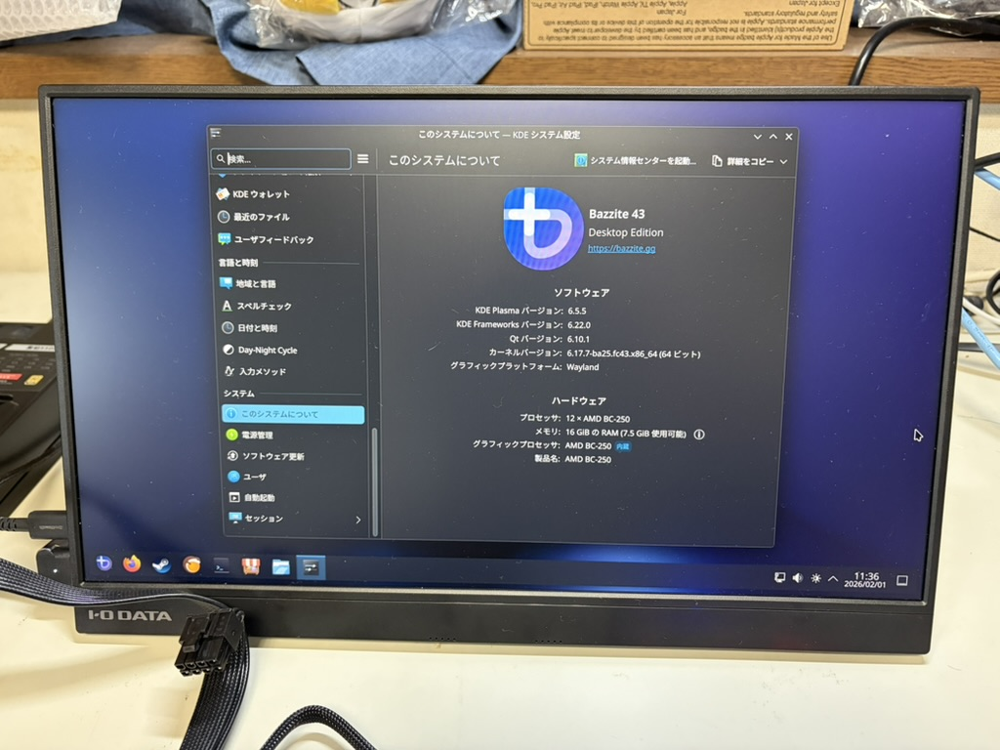
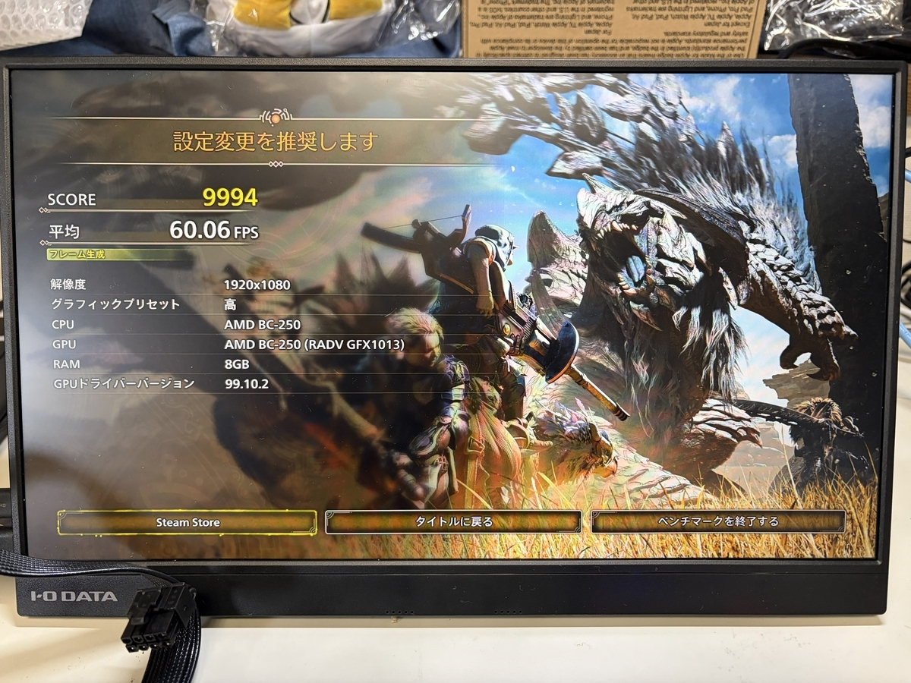

  
PS5 であったボードコンピューター AMD-BC-250

# PS5 であったボードコンピューター AMD-BC-250

最近、AMD-BC-250 を購入しました。

## CPU 製造の背景

一般に Core i7 や i5 など、CPU にはグレードがあります。これらは最初から i5 モデルを作るぞ！と製造してるわけでなく、製造後の不良具合によって、上位モデルや下位モデルに分類されて販売されます。

これは他のコアでも同様ですが、ゲーム機が対象のコアだと事情が変わります。ゲーム機はモデルはあれど同製品であれば性能は一般的に同一です。なお、Xbox Series X|S は X と S でコアに性能差があります。この製造の過程で発生する不良コアを再利用してるのかもしれません。知らんけど。

## AMD-BC-250

何の話をしてるんだ？と思われるでしょうが、この AMD-BC-250 のコアは PS5 向けに製造された CPU（APU）の不良品の再利用といわれています [^broken-PS5]。

[^broken-PS5]: AMD is selling broken PlayStation 5 APUs to cryptominers, https://videocardz.com/newz/amd-is-selling-broken-playstation-5-apus-to-cryptominers

PS5 には下位モデルがないので、不良品は PS5 には利用されません。また、カスタム CPU なので別の形で市販されることはありません、一般的には。

PS5 が発売された時期は、まだ暗号通貨のマイニングブームの真っ最中でした。どのような経緯は知りませんが、この不良品はマイニングのボードコンピューターとして再利用されました。それがまたどういうことか、一般市場に流れてきました。私が見た範囲では去年の 2024 年の秋ぐらいだった認識です。そのボードをついに私も手に入れました。

### 何に使えるの？

もともと PS5 ということで、ゲーム用途に強いです。このボードをゲーム機に改造する記事や動画が多くあります。これから私もこの機種で遊んでみます。なお、私は、本物の PS5 やそこそこのゲーミング PC を持っているので、正直不要です。ただ、面白そうだからという理由です。

## PS5 にする

まず最初に電源設定を変更します。初期状態では、電源を接続したら自動起動するようになっています。私は本体にある電源ボタンで電源制御をしたいので、自動起動の設定ピン [^AUTO_PWRON1] を変更します。

本体の電源ボタンで制御したいので、次のように設定ピンを変更しました。

[^AUTO_PWRON1]: AUTO_PWRON1, https://elektricm.github.io/amd-bc250-docs/hardware/pinouts/#auto_pwron1

### 電源装置の準備と加工

このボードには PCIe の 8 pin（6+2 pin）を利用して、12 V の電圧、そして最小で 220W の電力供給が必要です。参考サイト [^PowerSupply] から、Flex ATX 電源を利用しました。

[^PowerSupply]:Power Supply Requirements, https://elektricm.github.io/amd-bc250-docs/hardware/power/#basic-requirements

Metalfish 550W FlexATX を採用しました。この電源から PCIe 用の 8 ピンを本体に接続します。また、単体で給電するため、マザーボード用の給電ピンを針金でショートさせました。

ピンをショートさせた部分をカプトンテープで保護しました。

ちゃんと運用する場合は、どうにかしたいですね。

### ファン

このボードの発熱が激しいといわれてます。そこで先駆者の記事を参考にして、シロッコファンと 12 cm のファンを利用しました。

シロッコファンは固定が難しいです。基板からピンが立っており、送風口とヒートシンクの高さ位置は一致していません。送風が無駄にならないようにカプトンテープで簡単に固定しました。

12cm ファンはヒートシンクに載せました。載せただけです。

冬の室温 12℃ の暖房なし部屋で、起動しただけだと、だいたい 42℃ ぐらいでした。ただ、がっつりゲームするなら、もっと冷却を考えないといけないです。

### 起動

ボード本体に電源とファン、そしてモニタに接続しました。

無事に BIOS 画面の起動を確認しました。

次は OS のインストールです。M.2 SSD とインストール用の USB メモリを接続した。

このボードは Windows に対応していないので、Linux の Bazzite をインストールしました。イメージのダウンロードで GPU に AMD RX4xx+ を選択、インストールの過程で grub2 を選択するのを忘れずにすれば、あとは問題ないです。

Bazzite のインストールは無地に完了しました。

### ペンチマーク

Steam でモンスターハンターワイルズのベンチマークソフトをインストールしました。いざ、計測。

ヒートシンクから出てくる風の温度が温かくなり、ファンの回転も上がります。

ベンチマーク、無事に完走しました。

スコア 9984、平均 60 fps と、思ったより高い数値でした。画質設定を下げて調整すれば、プレイできそうですね。なお、ベンチマーク中の温度はだいたい 53℃ ぐらいでした。

### まとめ

ボードの温度管理が難しいです。形状が一般的な PC ではないので、冷却するためのファン固定が難しいです。

3D プリンターで自作されている方もいますが、私は持っていないのでどうするか。アクリル板に穴をあけて固定しているのも見るので、ケースは考えないといけないですね。次章では、そのケースを考えていきます。
