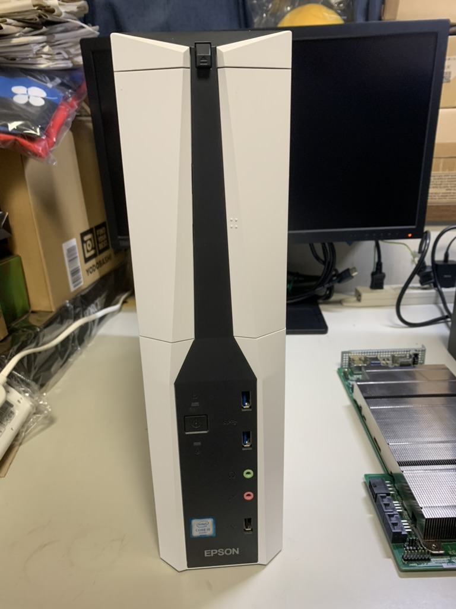
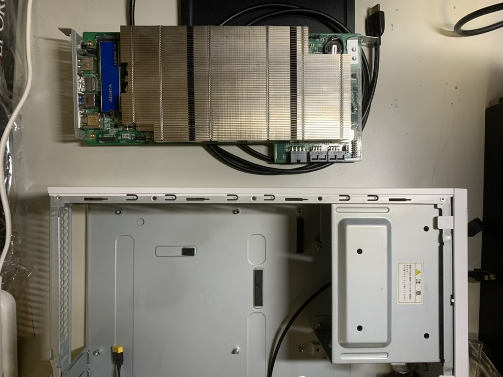
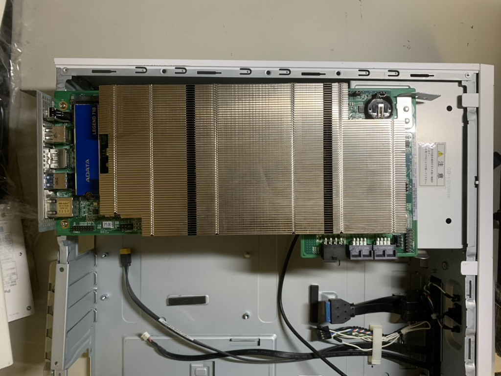
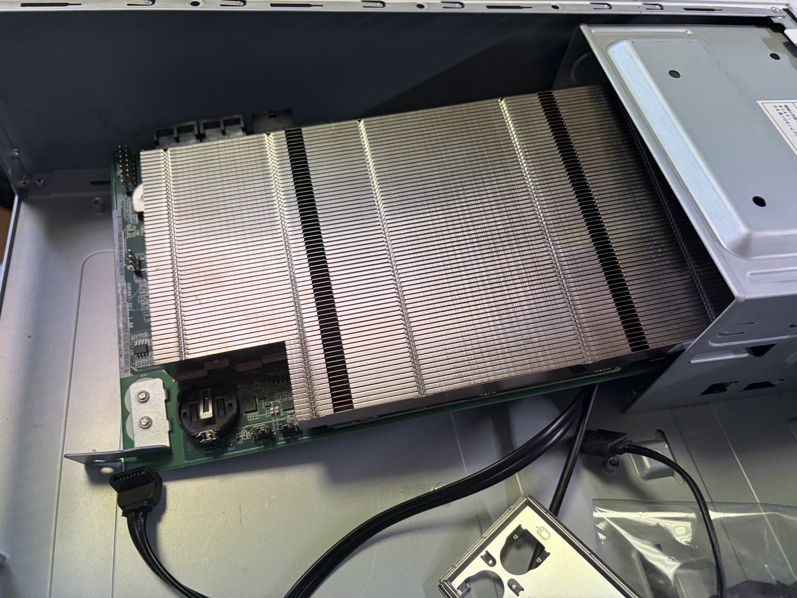
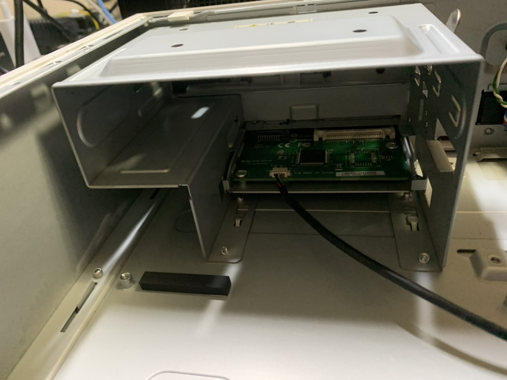
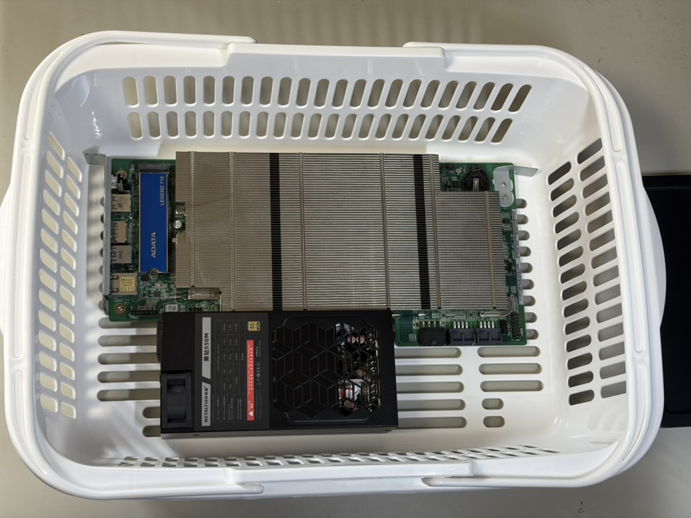
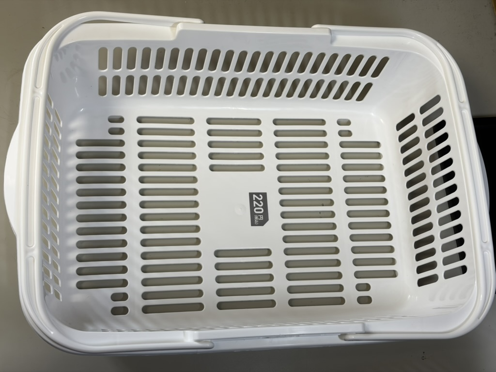

  
PS5 になれなかった PC ケース

# PS5 になれなかった PC ケース

気になる筐体をみつけました。遠目に見ると PS5 っぽい、Endeavor シリーズのスリム PC です。

{width=300}

この Endeavor シリーズのジャンク筐体をケース素材として購入しました。狙いは、前章で起動した PS5 になれなかった AMD-BC-250 を PS5 っぽい見た目にすることです。

PS5 本体のジャンクを使う方法もあります。ただ、ジャンクでも価格が高く、加工難度も高めです。今回は入手しやすく、失敗してもダメージが小さい PC 筐体で試しました。

## PC ケースに組み込む

PS5 に似た PC ケースを手に入れたので、AMD-BC-250 を実際に組み込んでいきます。まず筐体から中身を取り出し、AMD-BC-250 を仮置きして配置を確認しました。

{width=300}

結果は、無加工では入りませんでした。

{width=300}

敗因は光学ドライブ用マウンターです。マウンターはリベットで固定されており、簡単には外せません。私のスキルでは、ケース加工は難しいです。さらに、ヒートシンクと配線の逃げも必要なので、見た目以上に空間の余裕が足りませんでした。

向きを反転し、ケースの光学ドライブの空き口に AMD-BC-250 のコントローラー側をマウンター内に逃がす配置も試しました。

{width=300}

{width=300}

この配置でも、ケーブル取り回しと放熱スペースの両立ができませんでした。今回は Endeavor 筐体への組み込みはいったん断念します。

## 新たなるケース候補を探して

断念後は、条件を次の 3 点に絞って候補を探しました。

- 無加工または軽加工で AMD-BC-250 と電源が収まる
- 通気を確保しやすく、ファンの風を邪魔しない
- 安価で再入手しやすく、検証中に壊しても痛手が少ない

候補を比べた結果、近くの百均で購入したメッシュかごを採用しました。

{width=300}

<!-- {width=300} -->

固定は結束バンド中心ですが、風通しがよく、持ち運びしやすい点が検証用途に向いています。見た目の完成度より、試行回数を優先する判断です。

## 安牌なケース

常用を前提にするなら、アクリル板で挟む「サンドイッチ構成」が無難です。AMD-BC-250 にはブラケット側のネジ穴があるため、そこに合わせてアクリル板を加工すれば、比較的きれいに固定できます。

100 円ショップのダイソーで棚作成用のアクリル板 [^daiso] を売っており、AMD-BC-250 に近いサイズを取りやすいです。これを 2 枚使って基板を挟み、スペーサーで高さを作ると、卓上でも安定して運用できます。

この方式なら、配線の変更や冷却の試行を繰り返しやすく、章 3 の冷却検証にもつなげやすいです。見た目を追い込むのはそのあとでも遅くありません。

[^daiso]: アクリル棚（長方形、透明）, https://jp.daisonet.com/products/4550480190037
