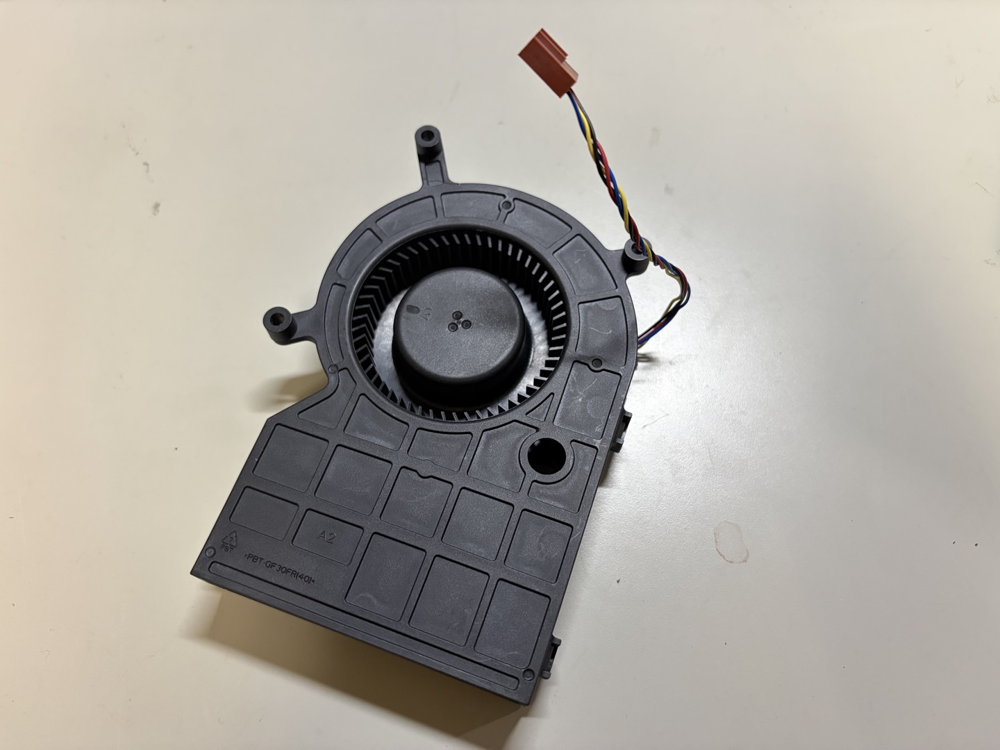
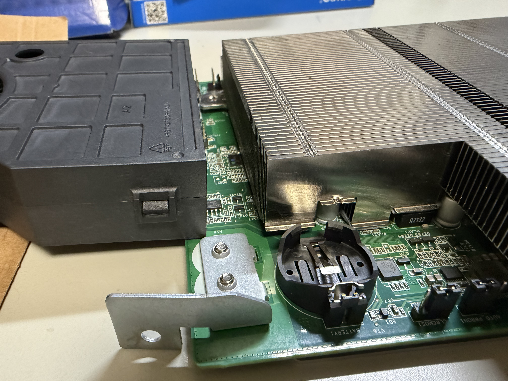
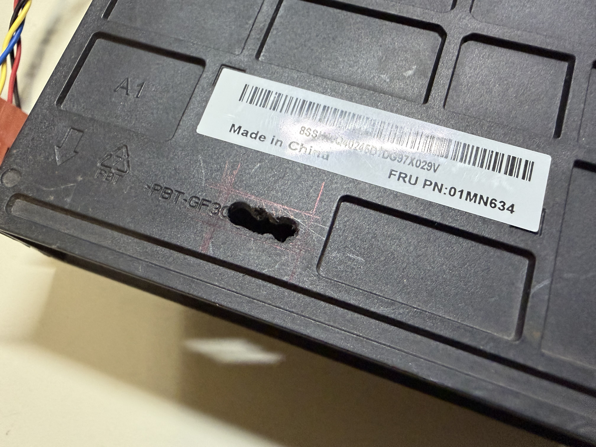
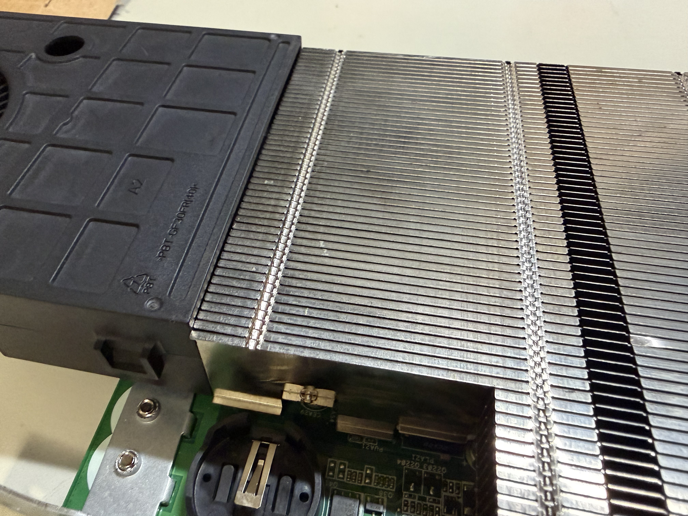
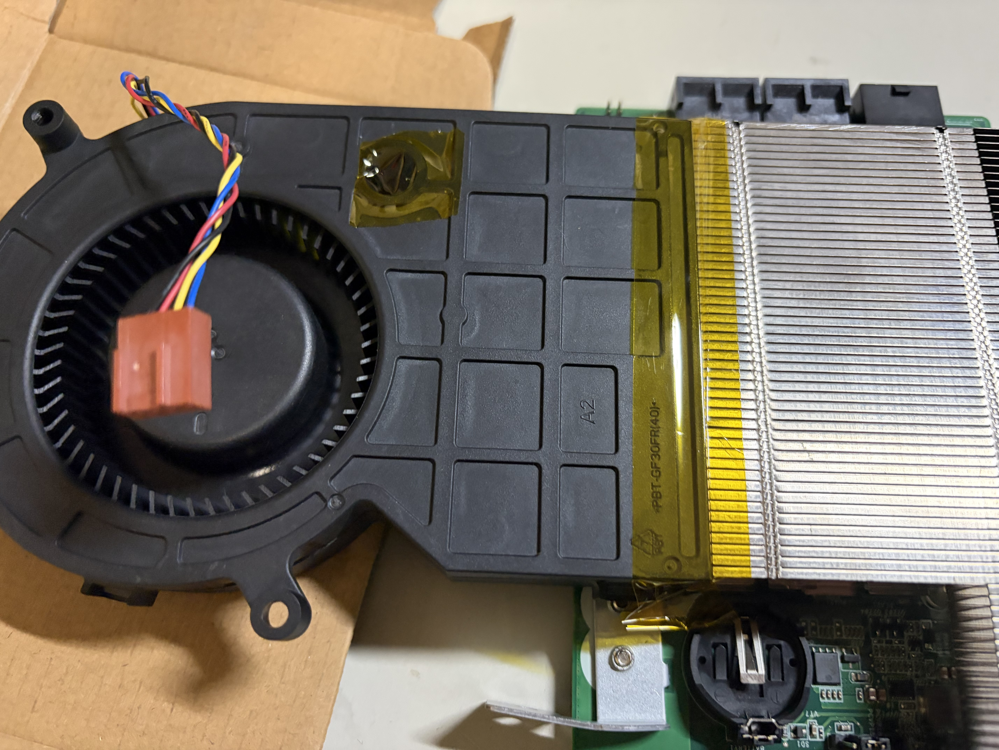
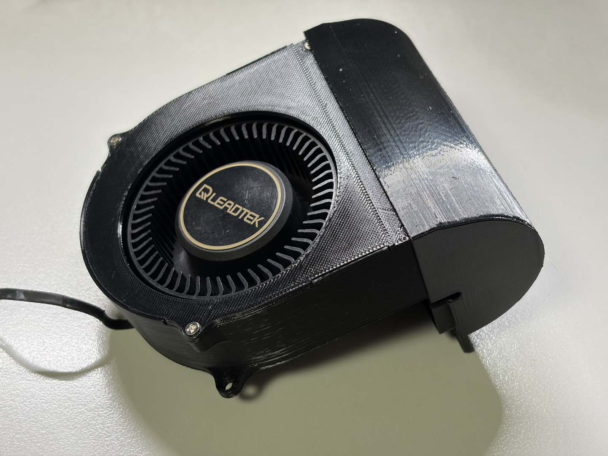
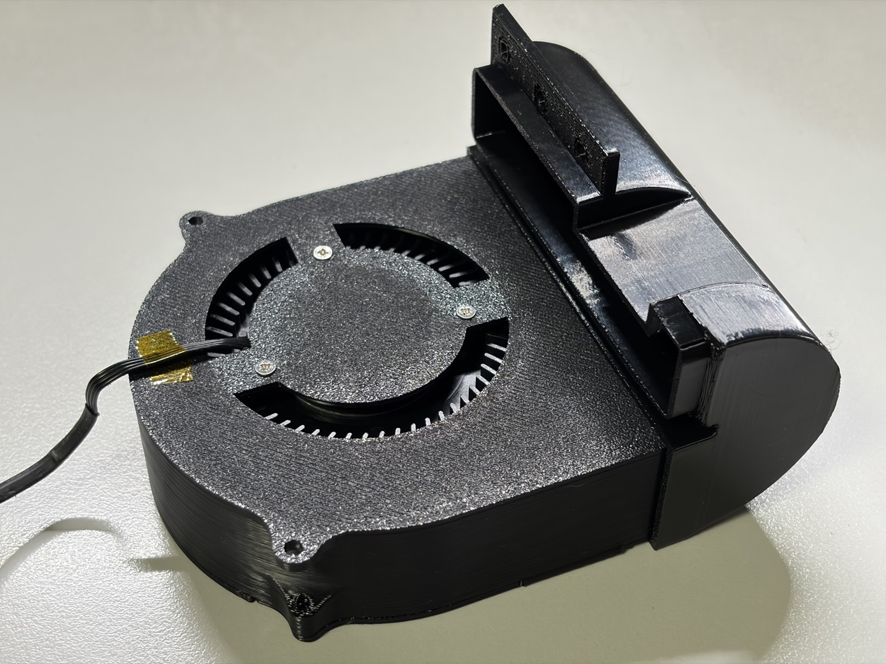
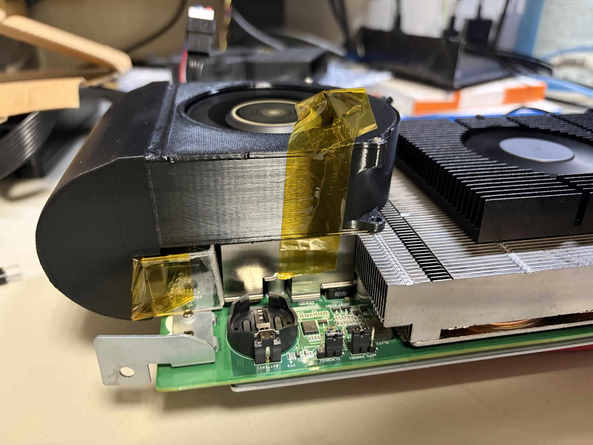
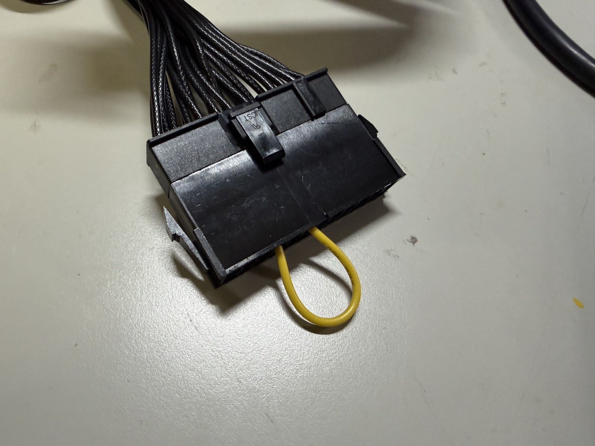
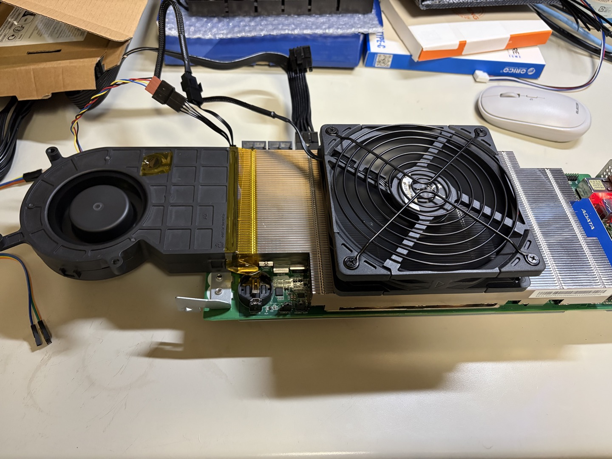

  
ケース選定を前提に冷却を考える

# ケース選定を前提に冷却を考える

前章ではケース選定の方向性を整理しました。本章ではその前提として、AMD-BC-250 で実際に組める冷却構成を比較します。目的は「温度を下げること」だけでなく、「ケースに収まること」と「取り付け作業の現実性」を両立することです。

第 1 章で試したとおり、このボードはシロッコファンの有無で温度の安定性が大きく変わります。そこで本章では、シロッコファン 2 種と通常ファン 3 種を組み合わせ、CPU 温度・ヒートシンク温度・ベンチスコアの 3 指標で比較しました。

## シロッコファン

本章で比較するシロッコファンは、形状の違いに注目した次の 2 種類です。風量が大きいほど冷えやすいのは前提として、AMD-BC-250 への取り付けやすさと送風の当てやすさの観点で評価します。

1 つ目は、一般的なストレート形状のシロッコファンです。風量を確保しやすく、ヒートシンクへ強く風を当てやすい点が利点です。

{width=300}

AMD-BC-250 のヒートシンクは側面側にスリットがあるため、そこにシロッコファンで風を送るのが最適です。しかし、シロッコファンを接続すると、ボード外周からはみ出るため、ケース設計の自由度は下がります。さらに、ヒートシンクのそばの基板にピンがあるため、送風をロスなくヒートシンクに送るのは難しいです。

{width=300}

当初は、その空き空間自体を埋めるためにカプトンテープを使って頑張りましたがさすがに厳しいです。そこで、シロッコファン背面のうち基板のピンと干渉する部分に穴をあけ、送風口とヒートシンクの位置ができるだけ一致するように調整しました。簡易加工ですが、送風ロスを減らす効果がありました。

{width=300}

{width=300}

邪魔だったピンがちょうどシロッコファンの固定に役立ちますが、固定はできないのでカプトンテープでヒートシンクとシロッコファンを固定しました。

{width=300}

2 つ目は、カーブ付きシロッコファンです。U 字カーブのジョイントを備えており、ファン本体をボード上に置きやすく、レイアウトを取り回しやすい点を利点としています。ただし、カーブ部は風路の抵抗になりやすい傾向があります。同条件では、ストレート形状より風量が落ちます。

{width=300}

{width=300}

こちらは AliExpress で購入しました。他のグラフィックボード向けに設計されており、AMD-BC-250 専用品ではありません。ジョイント部は 3D プリンター製で作られていたので、前述の穴あけ加工などをすると壊れそうなので、加工なしです。個人で 3D プリンターがあれば専用品を作れたのに…。

基板上のピンとの干渉を避けるため、ジョイント部分とヒートシンクの間をアクリル板で補助パーツを作って固定しています。アクリル加工も慣れてないので、ロスが大きいです。例によってカプトンテープで固定しました。

{width=300}

共通の課題は、どちらも専用品ではないため、送風口とヒートシンク位置の完全一致が難しい点です。結果として、多少の加工や送風ロスは避けられません。

## 通常ファン

通常ファンは、次の 3 パターンを用意しました。AMD-BC-250 のヒートシンクの上部に置きます。

- ファンのみ
- ファン＋ヒートシンク
- ファン一体型のヒートシンク

いずれも基本的な冷却方針は同じで、差が出るのは高さ・放熱面積・固定方法です。単体ファンは高さを抑えやすく、ファン＋ヒートシンクは放熱余力を取りやすく、ファン一体型ヒートシンクは配線と固定が簡単です。今回の目的では、単体の冷却力よりも、シロッコファンと組み合わせたときのバランスを重視して評価します。

インターネットを見ていると、AMD-BC-250 のヒートシンクは、上部に 2 つのスリットがあるものと、ないものがあります。私の個体は 2 つのスリットがあるタイプだったため、そのスリットから内部へ風を送り込めます。外側から風を当てるだけでなく、ヒートシンク内部にも風を通せるので、一定の冷却効果は期待できます。

ファンの補助として、外部ヒートシンクも追加しました。なお、外部ヒートシンクと AMD-BC-250 のヒートシンクは、そのまま載せただけです。本来はサーマルパッドで挟み、ヒートシンク同士をしっかり密着させるべきですが、手元に材料がなかったため、今回は妥協しました。

AMD-BC-250 のヒートシンクを加工し、上面全体にスリットを作って、そこへ風を送る例も見ました。そのほうが冷却能力は高そうですが、今回は AMD-BC-250 自体への破壊的加工は NG としたため、採用しませんでした。

## 計測

第 1 章では電源投入時にピンを針金でショートしていましたが、接触が不安定で再現性に欠けました。今回は検証条件をそろえるため、電源検証用の市販ショートソケットを使用しています。

{width=300}

各パターンで「モンスターハンターワイルズ ベンチマーク」を実行し、CPU 温度・ヒートシンク温度・ベンチスコアを記録しました。CPU 温度は Bazzite のシステムメニューを参照し、ヒートシンク温度は非接触の温度計で測定しています。見やすさのため、シロッコファンの種類ごとに表を分けて整理します。

### 通常シロッコファンの結果

|通常ファン|CPU 温度|ヒートシンク温度|ベンチスコア|
|---|---:|---:|---:|
|ファンのみ|61|27.3|10156|
|ファン＋ヒートシンク|58|28.2|10091|
|ファン一体型のヒートシンク|58|30.1|10250|

### カーブ付きシロッコファンの結果

|通常ファン|CPU 温度|ヒートシンク温度|ベンチスコア|
|---|---:|---:|---:|
|ファンのみ|62|30.7|10218|
|ファン＋ヒートシンク|62|33.9|10178|
|ファン一体型のヒートシンク|60|33.5|10279|

本計測は、室温や風の当て方を厳密に統一したものではありません。したがって、絶対値よりも「構成ごとの差分」を見る目的の参考値として扱います。

### 考察

まず通常シロッコファン側では、「ファン＋ヒートシンク」と「ファン一体型のヒートシンク」がともに CPU 温度 58 ℃でした。ただし、ベンチスコアは前者が 10091、後者が 10250 です。今回の条件では、追加ヒートシンク単体の効果より、ファン一体型のほうが全体のバランスを取りやすかったと見られます。

次にカーブ付きシロッコファン側では、「ファン一体型のヒートシンク」が CPU 温度 60 ℃、ベンチスコア 10279 で最良でした。ジョイントで風量は落ちやすいものの、配置の自由度が高いため、結果として風を当てやすかった可能性があります。

一方で、ヒートシンク温度はカーブ付きシロッコファンの全構成で 30 ℃台前半まで上がりました。通常シロッコファン側の 27.3〜30.1 ℃と比べると高めです。風路の曲がりや補助パーツまわりの隙間で、送風ロスが増えたと考えられます。

以上をまとめると、温度余力を優先するなら通常シロッコファン、スペース効率や取り回しを優先するならカーブ付きシロッコファン、という整理になります。総合では「通常シロッコファン＋ファン一体型のヒートシンク」が扱いやすく、再現しやすい構成でした。

{width=300}

## まとめ

今回の比較では、通常シロッコファンを軸に通常ファンを組み合わせる構成が、温度と作業性の両面で実用的でした。カーブ付きシロッコファンは、スコア面で大きく不利ではないものの、温度余力はやや小さく、ケース都合を優先する場合の選択肢になります。

ただし、どの構成も「専用品をそのまま組む」だけでは完成しません。干渉回避や送風経路の調整が必要で、手間はそれなりにかかります。

結論として、AMD-BC-250 の冷却検証は工作として十分に面白く、実験素材として優秀です。一方、常用機としての完成度を目指すには、固定方法の改善と長時間運用での再検証をもう一段進める必要があります。
